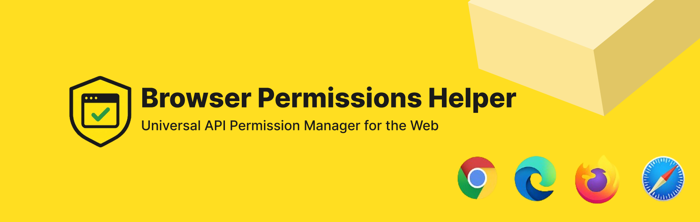

# Browser Permissions Helper




A simple utility to manage and request browser permissions seamlessly. This package provides an easy-to-use API for handling permissions like notifications, geolocation, camera, microphone, and more.

## 🚀 Features

- ✅ Check the current permission status for various browser APIs.
- 🔄 Request permissions dynamically.
- 📢 Handle permission changes efficiently.
- 🎯 Lightweight and easy to integrate.

## ✨ Preview

When you request a permission, a modern, customizable modal will appear to the user.


## 📦 Installation

```sh
npm install browser-permissions-helper
```

or

```sh
yarn add browser-permissions-helper
```

## 🛠 Usage

### Import the Module

```javascript
import {
  PermissionType,
  checkPermission,
  requestPermission,
  getPermissionSupportInfo
} from 'browser-permissions-helper';
```

### Check Permission Status

```javascript
const status = await checkPermission(PermissionType.Geolocation);
console.log(`Geolocation permission: ${status}`);
```

### Request Permission

```javascript
const result = await requestPermission(PermissionType.Notifications);
console.log(`Notification permission granted: ${result}`);
```

### Get Browser Support Info for permission

```javascript
const info = getPermissionSupportInfo(PermissionType.Bluetooth);
console.log(info.supportedBrowsers); // ['Chrome', 'Edge']
console.log(info.notes); // 'Not supported in Firefox or Safari'
```


## 📜 Supported Permissions

- `geolocation`
- `clipboard-write`
- `notifications`
- `camera`
- `microphone`
- `camera-advanced`
- `speaker-selection`
- `bluetooth`
- `midi`
- `nfc`
- `screen-wake-lock`
- `persistent-storage`
- `push`
- `idle-detection`
- `storage-access`
- `display-capture`
- `window-management`

## 📖 API Reference

### `checkPermission(permissionType: PermissionType) => Promise<'granted' | 'denied' | 'prompt'>`
Checks the current status of a given permission.

### `requestPermission(permissionType: PermissionType, styleOptions?: ModalStyleOptions) => Promise<boolean>`
Requests the specified permission from the user and returns `true` if granted, otherwise `false`.

This function displays a customizable modal to the user before the native browser permission prompt appears. The Reject button includes a 15‑second countdown; when it reaches zero, the request resolves to `false`.

#### Styling the Modal

You can customize the appearance of the modal by passing a `styleOptions` object. All properties are optional.

```javascript
const styleOptions = {
  modalBackgroundColor: '#333',
  modalTextColor: '#fff',
  modalBorderRadius: '15px',
  buttonAllowBackgroundColor: '#007bff',
  buttonAllowTextColor: '#fff',
  buttonRejectBackgroundColor: '#6c757d',
  buttonRejectTextColor: '#fff',
  buttonBorderRadius: '8px',
};

const result = await requestPermission(PermissionType.Notifications, styleOptions);
console.log(`Notification permission granted: ${result}`);
```

The `ModalStyleOptions` interface has the following properties:

- `modalBackgroundColor?: string`
- `modalTextColor?: string`
- `modalBorderRadius?: string`
- `buttonAllowBackgroundColor?: string`
- `buttonAllowTextColor?: string`
- `buttonRejectBackgroundColor?: string`
- `buttonRejectTextColor?: string`
- `buttonBorderRadius?: string`

### `getPermissionSupportInfo(permissionType: PermissionType) => { supportedBrowsers: string[]; notes?: string; }`
Returns a list of browsers that support the given permission, with optional notes for caveats or limited support.

## 🛡️ Browser Compatibility
This package works in modern browsers that support the **Permissions API**.

| Browser  | Supported |
|----------|----------|
| Chrome   | ✅ Yes   |
| Firefox  | ✅ Yes   |
| Edge     | ✅ Yes   |
| Safari   | ✅ Partial (Some permissions may not be available) |

> 💡 Use `getPermissionSupportInfo()` to programmatically check support for specific permission.


## 🤝 Contributing
Contributions are welcome! Feel free to fork the repository, create a feature branch, and submit a PR.

## 📜 License
This project is licensed under the **MIT License**.

## 📬 Contact
For any queries or issues, please [open an issue](https://github.com/darshitdudhaiya/browser-permissions-helper/issues).

---

⭐ **If you find this package useful, consider giving it a star on GitHub!** ⭐

